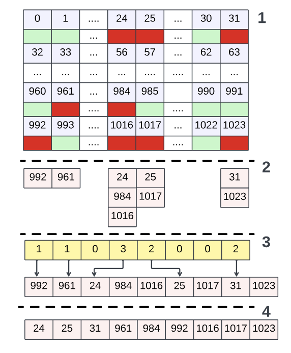

## Summary

Make a backwards compatible change to the serialization format for `Patches` used by the FastLanes-derived encodings:

* BitPacked
* Delta
* RLE
* ALP
* ALP-RD


## Motivation

The existing patching mechanism is not data parallel. Rather, retrieving a single patch requires either a binary search or linear scan within a chunk of values. As part of the push to implement first-class CUDA support for Vortex, we need all encodings to have fully data parallel decoding operations.


## Background - CPU Patching

The classic exception patching mechanism implemented by Vortex is optimized for super-scalar CPU execution:

1. Iterate 

We can achieve speedup in the patching step by unrolling the loop by a certain amount, but roughly we benefit by having them all accessed together.

## Background - GPU Execution

GPU execution requires us to break down our decoding operation into a set of **thread blocks**, where each block has some number of threads. Every pack of 32 threads is a **warp**. Warp execution is what makes GPUs so different from CPUs. In CPU programming, when you have multiple threads they are all running independently. On a GPU, every thread within a warp executes **in lockstep**, executing the exact same instructions at the same time. All memory accesses made by a warp in a given cycle are coalesced by the **SM** that the warp is running on. There are many warps executing on a single SM at once, and several dozens or hundreds of SM. This is what GPUs do: they help you write code to exploit large amounts of High-Bandwidth Memory (HBM) in parallel across many tasks.

In GPU land, all code that runs on devices is triggered by **kernels**. Launching a kernel involves copying all of the arguments from the host stackframe into GPU memory. It can take tens or sometimes hundreds of µseconds to launch a kernel. Any data pointed to by the kernel arguments must have been copied to the GPU before launch as well.

## Background - G-ALP

G-ALP was published in 2025, and its main contribution is to come up with a data-parallel layout for the exceptions for ALP decoding.



The crux of the model is

1. Split each sequence of 1024 values into a chunk
2. Reorient it into 32 lanes with 32 rows. Note that this aligns to the FastLanes lane count for 32-bit types.


Inside of our patching kernel, we can implement this instead

## Changes to Vortex

Vortex implements some of these instead


Let's look at the old kernel for unpacking a packed 3-bit representation into `u8`:


```c++
__device__ void _bit_unpack_8_3bw_32t(const uint8_t *__restrict in, uint8_t *__restrict out, uint8_t reference, int thread_idx) {
    __shared__ uint8_t shared_out[1024];
    _bit_unpack_8_3bw_lane(in, shared_out, reference, thread_idx * 4 + 0);
    _bit_unpack_8_3bw_lane(in, shared_out, reference, thread_idx * 4 + 1);
    _bit_unpack_8_3bw_lane(in, shared_out, reference, thread_idx * 4 + 2);
    _bit_unpack_8_3bw_lane(in, shared_out, reference, thread_idx * 4 + 3);
    for (int i = 0; i < 32; i++) {
        auto idx = i * 32 + thread_idx;
        out[idx] = shared_out[idx];
    }
}
```

Contrast that with the slightly updated new version:

```c++
__device__ void _bit_unpack_8_0bw_32t(const uint8_t *__restrict in, uint8_t *__restrict out, uint8_t reference, int thread_idx, GPUPatches& patches) {
    __shared__ uint8_t shared_out[1024];
    _bit_unpack_8_0bw_lane(in, shared_out, reference, thread_idx * 4 + 0);
    _bit_unpack_8_0bw_lane(in, shared_out, reference, thread_idx * 4 + 1);
    _bit_unpack_8_0bw_lane(in, shared_out, reference, thread_idx * 4 + 2);
    _bit_unpack_8_0bw_lane(in, shared_out, reference, thread_idx * 4 + 3);
        __syncwarp();
        PatchesCursor<uint8_t> cursor(patches, blockIdx.x, thread_idx, 32);
        auto patch = cursor.next();
        for (int i = 0; i < 32; i++) {
            auto idx = i * 32 + thread_idx;
            if (idx == patch.index) {
                out[idx] = patch.value;
                patch = cursor.next();
            } else {
                out[idx] = shared_out[idx];
            }
        }
}
```